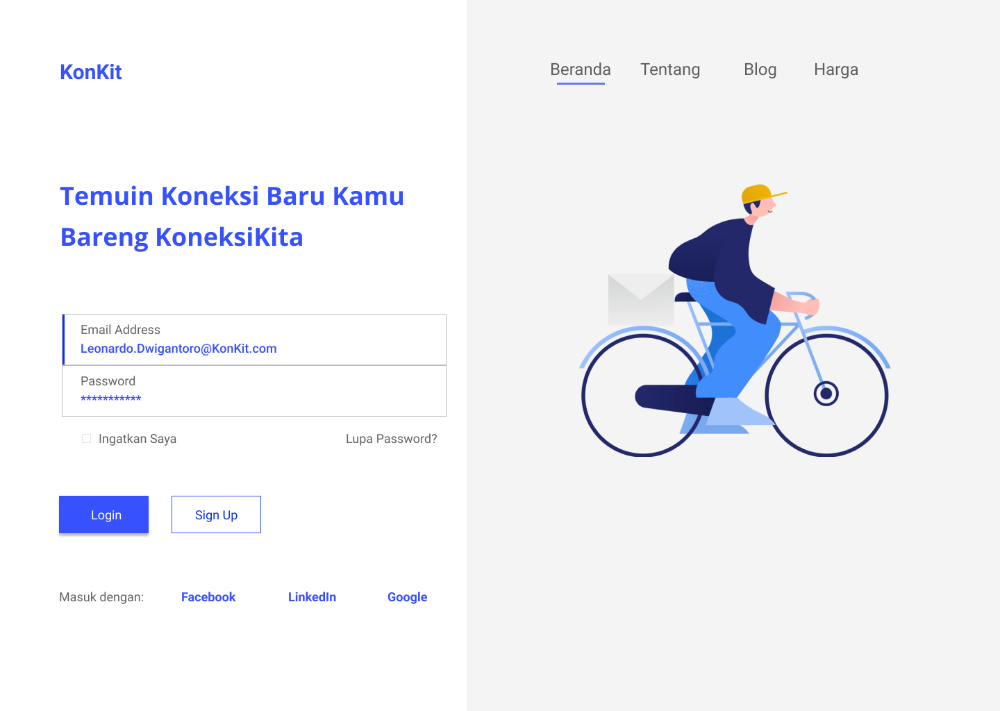
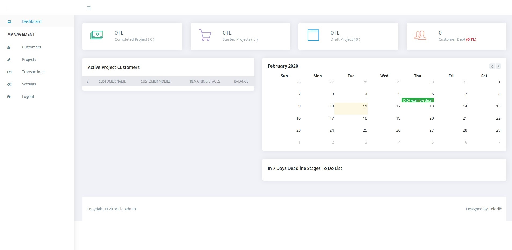
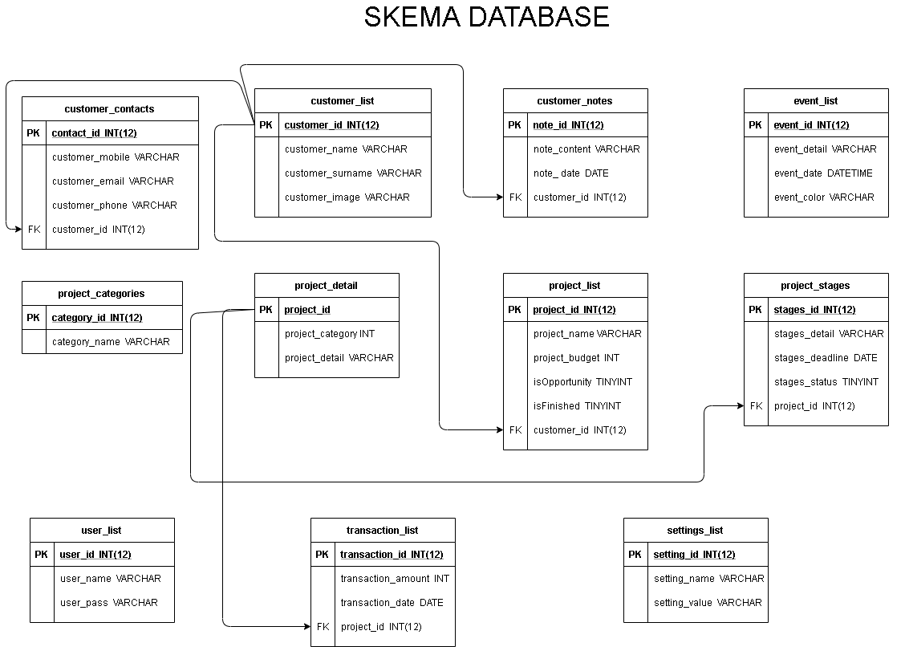

### KoneksiKita (KonKit)

### Fungsi
-Menjadi wadah bagi para pencari tenaga lepas dan freelance.  
-Mediator antara klien dan freelancer. 
-Menambah mata pencaharian dan penghasilan. 
-Menawarkan banyak fitur yang mempermudah para freelancer untuk membuat projek dan mempermudah para klien mencari freelancer yang diinginkan. 
-Menjadi wadah untuk menuangkan ide kreatif para freelancer. 

### Tujuan
Job portal khusus freelancer 
KoneksiKita atau disingkat KonKit adalah sebuah job portal yang dibuat khusus untuk para freelancer 
yang sedang mencari proyek ataupun klien yang sedang mencari freelancer. Situs ini memudahkan kedua 
belah pihak untuk mencari, berkomunikasi, dan menjalin kerja sama. Konkit juga berusaha menekan angka 
penggangguran dengan menjadi sebuah jobs platfrom.

### Target Pengguna
Para freelancer Indonesia 
Diharapakan dengan hadirnya Konkit dapat menjadi sebuah wadah bagi para freelancer Indonesia yang 
sebelumnya belum mempunyai platform khusus untuk ber-freelancing. Terutama ditengah pandemi Covid-19, dimana untuk mendapat perkerjaan cinderung sulit.

### Mock Up

### Skema Database

